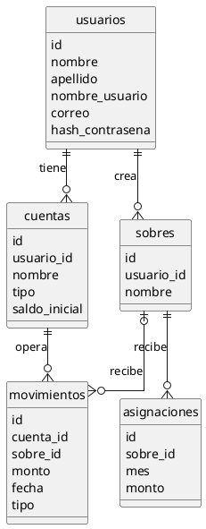

opencode -s ses_f21a09d30ffeo63KfDh05t4LmT

# Contexto del proyecto — finanzas personales (MVP)

Este archivo conserva todo el razonamiento, decisiones y ejemplos que surjan al
diseñar el MVP. **Léelo antes de retomar el trabajo.** No reemplaza a
`openspec/specs/`: guarda el *por qué* detrás de cada decisión.

Última actualización: 2026-09-26.

---

## 1. Qué es este proyecto

App de finanzas personales con **presupuesto por sobres** (estilo YNAB). Cada
peso recibe un destino explícito antes de gastarse. Los sobres son del usuario y
de su propiedad exclusiva.

El MVP **no tiene código todavía**. Solo existe la especificación.

---

## 2. Estado actual del repositorio

```
mvp/
├── CONTEXTO.md          ← este archivo
├── modelo.puml          ← diagrama de relaciones
└── openspec/
    ├── config.yaml
    └── specs/
        ├── .gitkeep
        └── autenticacion/spec.md
```

### Lo que se hizo en esta sesión

| Acción | Detalle |
|---|---|
| Se eliminó `specs/dashboards/` | Describía lectura de datos que el sistema no sabe crear (métricas, gráficas, alertas de presupuesto, tooltips). 4 requisitos. |
| Se eliminó `specs/movimientos/` | Describía listado y filtrado, pero no crear/editar/borrar. 4 requisitos. |
| Se renombró `specs/user-auth/` → `specs/autenticacion/` | Consistencia de idioma con las tablas y capacidades nuevas en español. También se actualizó el encabezado del `spec.md`. |

### Por qué se eliminaron

Los dos specs describían una **capa de vista sin capa de escritura**. Detallaban
qué mostrar, pero ningún requisito decía cómo nace una cuenta, un movimiento o un
sobre. Implementarlos al pie de la letra produce una app donde se puede crear una
cuenta y ver un panel siempre en cero.

Además, el autor original nunca abrió un ciclo de cambio: no existe
`openspec/changes/`. Los specs se escribieron a mano en una sola sesión de ~4
minutos (sellos de tiempo: 11:29–11:33 del 26 de septiembre).

---

## 3. Conceptos de OpenSpec

| Concepto | Qué es |
|---|---|
| **OpenSpec** | Metodología donde la especificación es el artefacto primario y el código se deriva de ella. |
| **Capacidad** | Unidad de organización: una carpeta en `specs/`. Agrupa comportamiento del sistema. |
| **Spec** | `spec.md` dentro de la carpeta. Describe el **estado actual**. |
| **Requisito** | `### Requirement:` + párrafo con SHALL. Una obligación. |
| **Escenario** | `#### Scenario:` + viñetas WHEN/THEN. La unidad verificable: un test por escenario. |
| **Cambio (change)** | Carpeta en `changes/` con `proposal.md`, `design.md`, `tasks.md` y los deltas. |
| **Delta** | Solo lo que el cambio agrega, modifica o quita (`## ADDED REQUIREMENTS`, etc.). |
| **Archivo** | Changes completados, movidos a `changes/archive/`. |

### `specs/` vs `changes/`

```
openspec/
├── specs/      → lo que el sistema ES HOY (estado acumulado, la fuente de verdad)
└── changes/    → lo que SERÁ (cambios en curso)
```

Flujo: `propose → apply → archive`. Los deltas del change se fusionan en `specs/`
al archivar.

### Estructura objetivo

```
openspec/
├── config.yaml
├── specs/                       ← ESTADO VIGENTE
│   ├── autenticacion/           ← ya existe
│   ├── cuentas/                 ← pendiente
│   ├── sobres/                  ← pendiente (el núcleo)
│   ├── transacciones/           ← pendiente (CRUD, no solo listar)
│   └── traspasos/               ← pendiente
└── changes/                     ← TRABAJO EN CURSO (no existe aún)
    ├── <aaaa-mm-dd-descripcion>/
    │   ├── proposal.md
    │   ├── design.md
    │   ├── tasks.md
    │   └── specs/<capacidad>/spec.md   ← DELTAS, no el spec completo
    └── archive/
```

### Capacidad ≠ módulo de código

Una capacidad **no** es una pantalla, un módulo, una tabla ni una capa. Es un
conjunto de comportamientos agrupados por afinidad.

Dos pruebas para validar un nombre:

1. Si mañana cambias de framework, ¿esta carpeta sigue teniendo sentido?
2. ¿Puedes escribir todos sus escenarios sin mencionar pantalla, archivo o lenguaje?

`dashboards` fallaba ambas: era el nombre de una pantalla. De ahí el renombre
conceptual a capacidades por comportamiento.

---

## 4. El modelo mental de los sobres

### La imagen

Botes con etiqueta. Cuando te pagan, el dinero entra a tu cuenta y tú decides
cuánto va en cada bote. Ese dinero ya tiene destino. Cuando gastas, sale del bote
correspondiente. El bote es tu límite.

### La invariante

```
patrimonio neto (cuentas − tarjeta)  =  Σ botes + dinero suelto
```

Si esto no cuadra, hay un bug. Debe cumplirse en **cualquier** momento, con
**cualquier** combinación de datos. Es el único test que importa.

### Los tres estados del dinero

| Estado | Significado |
|---|---|
| En un bote | Dinero con destino asignado, listo para gastarse |
| Gastado | Ya salió de un bote |
| **Suelto** | Dinero que llega y aún no tiene destino (puede ser negativo) |

### Seis reglas del método

1. **Dale trabajo a cada peso** — nada queda suelto.
2. **Acepta tu gasto real** — el presupuesto se ajusta a la realidad, no al revés.
3. **Roda con los golpes** — un desborde se tapa con dinero suelto.
4. **Envejece tu dinero** — reduce el tiempo entre ganar y gastar.

(Y dos meta-reglas: el sobre es un **límite blando**, no una cuenta; los meses
**no reinician** nada, son filtros.)

### Los dos errores clásicos

**Repetir el plan del mes anterior.** Si en enero metiste 500 en un bote y
gastaste 800, el plan estaba mal desde enero, no desde febrero. Repetir 500 en
febrero da `−300 + 500 − 800 = −600`: **duplicas la deuda**.

**Cuadrar mes a mes.** Si partes de cero cada mes, el número siempre "sale
bien" y nunca ves que el plan original era irreal.

### La fórmula para tapar un desborde

```
asignar = deuda pendiente + gasto esperado del mes + colchón
```

| Si esperas gastar… | Asignas | Disponible final |
|---|---|---|
| 610 | 210 + 610 = **820** | 0 |
| 400 (te comprometes a bajar) | 210 + 400 = **610** | 0 |
| 610 + colchón de 180 | **1,000** | +180 |

Ni 210 (solo la deuda) ni 400 (copiar el mes anterior). El número sale de la
fórmula.

**820 es una corrección de una sola vez.** Una vez saldada la deuda, los 210
componentes desaparecen: a partir del mes 3 asignas gasto esperado + colchón.

**Cuadrar en 0 no es estar cómodo.** Con disponible 0 cualquier gasto inesperado
vuelve a generar deuda. El colchón no es lujo.

### Sobre vs. categoría

**Son lo mismo.** En este modelo toda categoría es un sobre: no hay dos
conceptos. Una categoría tiene cuánto se le asignó, cuánto se gastó y cuánto
queda (acumulado).

### Los meses

El presupuesto es **uno solo y continuo**. El mes es un filtro para ver el
movimiento, no una caja que se vacía. Lo que no gastas se acumula. Un sobre vacío
en julio sigue vacío en agosto.

---

## 5. Los casos límite

Son los que un MVP debe soportar. Todos derivados de un ejemplo de 6 meses.

| # | Caso | Qué exige el sistema |
|---|---|---|
| 1 | **Gasto con tarjeta**: el bote baja aunque el banco no se mueva | El sobre es una promesa, no dinero físico |
| 2 | **Reembolso**: el bote sube | Activity negativa, no dinero nuevo |
| 3 | **Sobre en negativo**: se gastó más de lo que había | Permitirlo, mostrarlo, y decidir quién lo paga |
| 4 | **Tapar el negativo** con dinero suelto | Automático con aviso (recomendado); alternativa manual |
| 5 | **Mover entre botes**: reetiqueta | Σ botes no cambia, RTA no cambia, no se crea dinero |
| 6 | **Transferencia entre cuentas** | **No toca botes ni RTA.** Solo mueve saldos de cuenta |
| 7 | **Borrar un movimiento** | Todo se recalcula desde cero. Nunca guardar saldos |
| 8 | **Pagar la tarjeta** | **Solo transferencia.** NO requiere apartar en un bote |
| 9 | **Movimiento sin asignar** | Dinero en limbo esperando destino (`sobre_id` nulo) |
| 10 | **Víndice sobre↔cuenta** | Independiente. El sobre no fuerza a una cuenta real |

### Los dos errores de implementación más comunes

**Tratar el pago de la tarjeta como asignación.** La factura ya se descontó del
bote al comprar. Pagar es **solo mover dinero entre cuentas**. Si exiges
apartarlo en un bote, rompes la invariante.

**Guardar saldos precalculados.** Si al borrar un movimiento no recalculas, el
error se vuelve permanente. Todo se deriva: disponible, dinero suelto, saldo de
cuenta, patrimonio.

### Un error que cometimos en el ejemplo

Al borrar un cobro de 250 (duplicado en tarjeta), sumamos +250 al bote pero
dejamos la deuda de la tarjeta igual. **Borrar una fila mueve el bote y la
cuenta a la vez**, o la invariante se rompe. El mes 1 corregido quedó:

```
Comida 860 · Transporte 500 · Diversión 0 · Salud 400 · Ahorro 2,000
Σ botes 3,760 + dinero suelto 900 = 4,660 = banco 2,660 + ahorro 2,000 ✓
```

Los meses 2–6 del ejemplo arrastran el mismo error en sus filas de borrado. **No
usar esos números como referencia en los specs.** Hay que rehacerlos.

### El principio que resuelve los casos difíciles

> **El sistema debe dejarte equivocarte, pero no debe mentirte.**

- Te deja repartir de más → pero avisa que el dinero suelto quedó negativo
- Te deja gastar más de un sobre → pero el sobre muestra el negativo real
- Te deja borrar → pero recalcula todo desde cero
- Te deja archivar con saldo → pero te obliga a decidir a dónde va

Si esto se escribe como principio explícito en los specs, los casos difíciles se
resuelven solos.

---

## 6. Modelo de datos

Tablas y atributos **en español**, sin acentos en los identificadores.

### Diagrama

Ver `modelo.puml`. Cinco entidades:



### Las 5 entidades

| Entidad | Guarda | Rol |
|---|---|---|
| **usuarios** | quién entra | 1 → muchas cuentas, sobres y movimientos |
| **cuentas** | banco, ahorro, efectivo, tarjeta | 1 → muchos movimientos |
| **sobres** | los botes (comida, transporte…) | 1 → muchas asignaciones y movimientos |
| **asignaciones** | cuánto se metió en un sobre en un mes | cuelga de `sobres` |
| **movimientos** | cada gasto, ingreso o traspaso | cuelga de `cuentas` y `sobres` |

### Atributos

**usuarios**: `id` · `nombre` · `apellido` · `nombre_usuario` · `correo` ·
`hash_contrasena`

**cuentas**: `id` · `usuario_id` · `nombre` ("Banco", "Ahorro", "Visa") · `tipo`
(`corriente` · `ahorro` · `efectivo` · `credito`) · `saldo_inicial`
(`credito` → saldo **negativo** = deuda)

**sobres**: `id` · `usuario_id` · `nombre`. **Sin columna de saldo.**

**asignaciones**: `id` · `sobre_id` · `mes` (`YYYY-MM`) · `monto` (siempre
positivo; único por `(sobre_id, mes)`)

**movimientos**: `id` · `cuenta_id` · `sobre_id` (nullable) · `monto` (**con
signo**: negativo = gasto, positivo = ingreso) · `fecha` · `tipo` (`gasto` ·
`ingreso` · `traspaso`)

### `sobre_id` nullable

`sobres |o--o{ movimientos`: la relación es **opcional**. Un movimiento puede
quedar sin sobre. Es la mecánica central de YNAB: el dinero llega y espera
decisión.

### `usuario_id` en `movimientos`: redundante

El usuario ya se sabe por `cuenta_id → cuentas → usuario_id`. Se puede omitir:

| | Con `usuario_id` | Sin `usuario_id` |
|---|---|---|
| Consultas del panel | más rápidas (hay que unir con `cuentas`) | lentas |
| Fuga entre usuarios | menor, la base filtra sola | depende del join |
| Consistencia | puede desincronizarse | imposible que se contradiga |

**Para el MVP: omitir.** Menos superficie de bug. Si crece, se agrega.

### Los 3 cálculos derivados (NO son tablas)

Se calculan siempre, nunca se guardan.

```
saldo_cuenta  = saldo_inicial + SUM(monto de sus movimientos)

disponible(sobre, mes) = SUM(asignaciones hasta ese mes)
                       + SUM(monto de sus movimientos hasta fin de mes,
                             excluyendo tipo = traspaso)

dinero_suelto = SUM(saldo de todas las cuentas) - SUM(disponibles de todos los sobres)
```

Las tarjetas entran con saldo negativo, así que **restan dinero suelto**. Eso es
la deuda.

**Invariante:** `patrimonio = SUM(disponibles) + dinero_suelto`

### Tablas opcionales (fuera del MVP)

| Tabla | Para qué |
|---|---|
| `grupos` | agrupar sobres (Necesidades, Deseos, Ahorros) |
| `metas` | "juntar 20,000 para vacaciones antes de diciembre" |
| `reglas` | "si es Walmart → Comida" |
| `meses_presupuesto` | estado abierto/cerrado (se puede derivar de `asignaciones`) |

---

## 7. Decisiones tomadas

| Decisión | Elección | Por qué |
|---|---|---|
| Tablas y atributos en español | Sí, snake_case sin acentos | Consistencia con las capacidades |
| Nombre de `transactions` | `movimientos` | Se eliminó el spec viejo, no la entidad |
| Sobre y categoría | **Son lo mismo** | En YNAB toda categoría es un sobre |
| Disponible | **Siempre calculado**, nunca guardado | Si no, los borrados no se reparan |
| Saldo de cuenta | **Siempre calculado** | Mismo motivo |
| Dinero suelto puede ser negativo | Sí, y se avisa | Es la señal de sobre-asignación |
| `usuario_id` en `movimientos` | **Omitido** en el MVP | Menos superficie de bug |
| `sobre_id` nullable | **Sí** | Dinero en limbo, mecánica central |
| Meses | No reinician; filtro temporal | Un solo presupuesto continuo |
| Pago de tarjeta | **Solo transferencia**, no asignación | El dinero ya se descontó al comprar |
| Transferencia entre cuentas | No toca botes ni dinero suelto | No es gasto |
| Fila eliminada | Mueve **bote y cuenta** a la vez | Si no, rompe la invariante |
| Grupos y metas | Fuera del MVP | Se pueden agregar después sin romper el modelo |
| Multimoneda | Fuera de alcance | Multiplica todo por tipo de cambio |
| Usuarios compartidos / debtsplit | Fuera de alcance | Complejo |

---

## 8. Decisiones pendientes

Estas siguen abiertas. **Resolverlas antes de escribir los specs nuevos.**

### Bloqueantes (afectan los requisitos)

| # | Pregunta | Opciones |
|---|---|---|
| 1 | **Cómo se tapa un desborde** | (a) automático mientras alcance, con aviso · (b) manual, el usuario elige de qué sobre · (c) bloquear si no alcanza |
| 2 | **Archivar un sobre con saldo** | (a) reasignar antes, no dejar archivar · (b) sigue contando aunque esté oculto · (c) el saldo vuelve al dinero suelto |
| 3 | **Borrar un sobre con movimientos** | (a) solo archivar, nunca borrar · (b) reasignar movimientos a otro sobre · (c) borrar todo en cascada |
| 4 | **Edición retroactiva** | Confirmar que registrar un movimiento de marzo recalcula marzo y cambia el panel de marzo a posteriori |
| 5 | **Mes al que pertenece un movimiento** | Calendario de la **fecha** (no del registro). Definir zona horaria del usuario: un 31 a las 23:00 puede saltar de mes |
| 6 | **Redondeo y centavos** | 1,000 entre 3 botes = 999.99. ¿Dónde va el centavo? Regla de redondeo en porcentajes y alertas |

### De alcance

| # | Pregunta | Opciones |
|---|---|---|
| 7 | **Alcance del primer change** | (a) un change que quita lo viejo y agrega `cuentas`/`sobres`/`transacciones`/`traspasos` · (b) 4 changes separados, flujo estricto |
| 8 | **El panel** | (a) al final, con el modelo ya firme · (b) ahora, como spec de solo lectura de derivados |
| 9 | **Auto-asignación** | ¿en el MVP o después? Reparto automático con prioridad: tapar desborde → completar metas → repartir resto |
| 10 | **Conciliación bancaria** | ¿en el MVP? Sin ella la app puede mentir |

---

## 9. Convenciones de los specs

Heredadas de los specs existentes:

- Escritos en **español**
- Marcadores estructurales en inglés: `## Purpose`, `## Requirements`,
  `### Requirement:`, `#### Scenario:`
- Palabras clave de convención en inglés: `SHALL`, `WHEN`, `THEN`
- **Sin mencionar stack**: ni lenguajes, ni frameworks, ni base de datos, ni
  nombres de archivo. Así el spec sobrevive a un cambio de stack.

Ejemplo de formato (de `autenticacion/spec.md`):

```markdown
### Requirement: El usuario puede iniciar sesión con username y contraseña
El sistema SHALL autenticar a los usuarios por username y contraseña
verificada con bcrypt.

#### Scenario: Inicio de sesión exitoso
- **WHEN** un usuario registrado envía su username y la contraseña correcta
- **THEN** el sistema crea una sesión y redirige al usuario al panel principal
```

---

## 10. Cómo retomar el trabajo

1. Lee las secciones 7 y 8 (decisiones tomadas y pendientes).
2. Resuelve las decisiones pendientes de la sección 8.
3. Crea el primer change en `openspec/changes/` siguiendo la estructura de la
   sección 3.
4. Al archivarlo, los deltas se fusionan en `openspec/specs/`.

**No escribas specs usando los números del ejemplo de 6 meses de la sección 5.**
Tienen errores en las filas de borrado. Si necesitas ejemplos para un spec,
rehazlos y verifica siempre contra la invariante.
